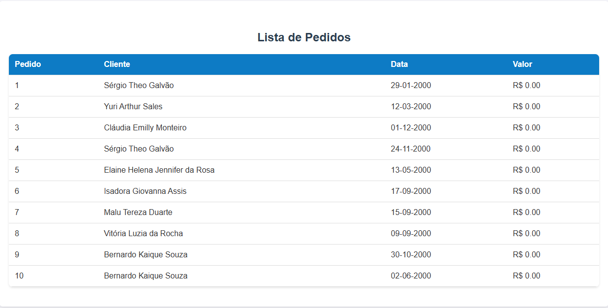
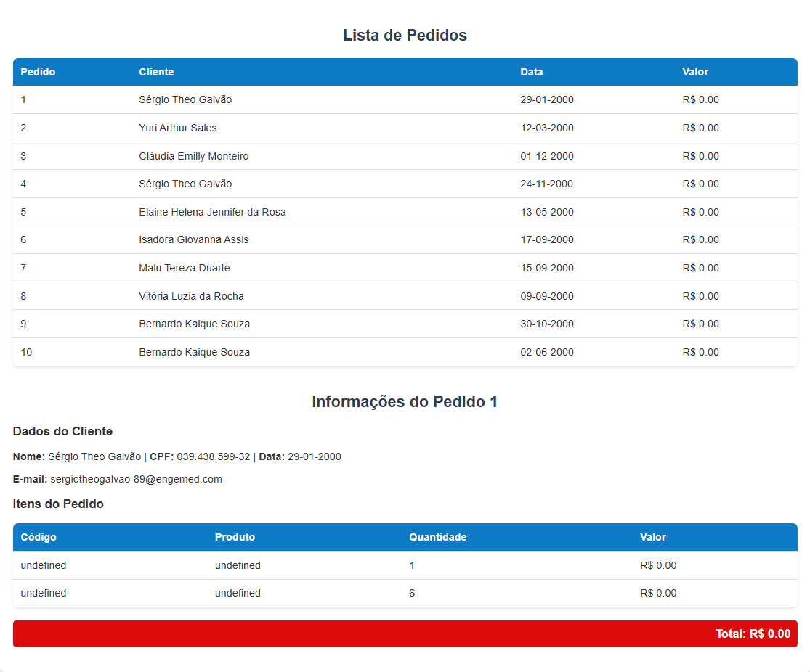

# 🚀 Desafio Técnico - Lift | Processo Seletivo

Este projeto foi desenvolvido como parte do processo seletivo para a empresa **Lift**. A proposta consistia em consumir uma API REST fornecida pela empresa, listar os pedidos disponíveis e exibir os detalhes de um pedido selecionado, utilizando tecnologias web (HTML, CSS e JavaScript puro).

---

## 📌 Objetivo

- Listar os **pedidos** retornados pela API.
- Exibir os **detalhes de um pedido selecionado**, incluindo:
  - Informações do **cliente**.
  - Lista dos **produtos** do pedido.
  - **Quantidade**, **valor unitário** e **valor total**.
- Apresentar os dados de forma organizada e responsiva.

---

## 🧰 Tecnologias Utilizadas

- **HTML5**: Estrutura da interface.
- **CSS3**: Estilização e layout responsivo.
- **JavaScript (ES6+)**: Lógica de consumo da API e manipulação do DOM.

---

## 🗂️ Estrutura de Pastas

- `index.html`: Página principal da aplicação.
- `style.css`: Estilos gerais da aplicação.
- `script.js`: Código JavaScript responsável pelas requisições e lógica.
- `README.md`: Este arquivo de instruções.

---

## 🔗 API Lift

A base da API fornecida é:

`https://sistemalift1.com.br/lift_ps/api/`

### Endpoints Utilizados:

- `GET /Pedidos` → Lista todos os pedidos.
- `GET /Pedidos/{id}` → Detalhes de um pedido.
- `GET /Clientes/{id}` → Detalhes do cliente.
- `GET /ItensPedido/{pedido}` → Itens de um pedido.
- `GET /Produtos/{id}` → Detalhes de um produto.

---

## 🖥️ Como Executar o Projeto

### 🔧 Requisitos:

- Um navegador moderno (Chrome, Edge, Firefox).
- Conexão com a internet (para acessar a API da Lift).

### 📌 Passo a Passo:

1. **Clone este repositório**:
   ```bash
   git clone https://github.com/matheuscoronado/sistemaLift

2. **Abra o arquivo index.html diretamente no navegador**:

> Clique duas vezes no index.html ou
> Clique com o botão direito > "Abrir com" > Navegador

3. **Interaja com a interface**:

> A lista de pedidos será carregada automaticamente.  
> Clique em qualquer pedido para visualizar seus detalhes.

---

## 📷 Captura de Tela

  
  
A interface foi projetada para ser limpa, intuitiva e responsiva, garantindo uma boa experiência para o usuário.

---

## 📌 Diferenciais Implementados

- **Interface limpa e intuitiva**: Design simples e funcional, com foco na usabilidade.
- **Separação clara entre lista de pedidos e detalhes**: Organização visual para facilitar a navegação.
- **Cálculo total automático**: O valor total do pedido é calculado dinamicamente com base nos itens.
- **Consumo eficiente da API**: Utilização de `async/await` para garantir requisições assíncronas e fluídas.

---

## 🧑‍💻 Autor

**Matheus Henrique Coronado Elias**  
Estudante de Análise e Desenvolvimento de Sistemas  

- **E-mail**: [matheuscoronado48@gmail.com](mailto:matheuscoronado48@gmail.com)  
- **GitHub**: [https://github.com/matheuscoronado](https://github.com/matheuscoronado)

---

## 📨 Entrega

O código completo foi desenvolvido conforme as orientações do desafio e está pronto para avaliação.  
Para dúvidas ou problemas na execução, estou disponível para contato!

---

✅ **Obrigado pela oportunidade!**